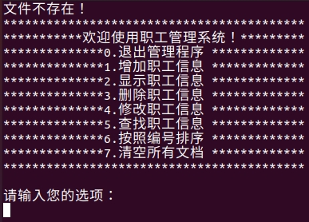

- [1.职工管理系统的C++实现介绍](#1职工管理系统的c实现介绍)
- [2.创建项目](#2创建项目)
- [3.创建管理类](#3创建管理类)
- [4.实现菜单功能](#4实现菜单功能)
  - [4.1 添加成员函数](#41-添加成员函数)
  - [4.2 菜单功能实现](#42-菜单功能实现)
  - [4.3 菜单功能验证](#43-菜单功能验证)
- [5.退出功能实现](#5退出功能实现)
  - [5.1提供功能接口](#51提供功能接口)
  - [5.2添加退出功能](#52添加退出功能)
  - [5.3退出功能测试](#53退出功能测试)
- [6.增加新职工](#6增加新职工)
  - [6.1创建职工抽象类](#61创建职工抽象类)
  - [6.2创建普通员工类](#62创建普通员工类)
  - [6.3创建经理类](#63创建经理类)
  - [6.4创建老板类](#64创建老板类)
  - [6.5测试多态](#65测试多态)
- [7.添加职工](#7添加职工)
  - [7.1功能分析](#71功能分析)
  - [7.2功能实现](#72功能实现)
- [8.文件交互-写功能](#8文件交互-写功能)
  - [8.1设定文件路径](#81设定文件路径)
  - [8.2成员函数声明](#82成员函数声明)
  - [8.3写文件测试](#83写文件测试)
- [9.文件交互-读功能](#9文件交互-读功能)
  - [9.1文件未创建](#91文件未创建)
  - [9.2文件存在但是为空](#92文件存在但是为空)
  - [9.3文件存在且不为空](#93文件存在且不为空)
    - [9.3.1获取职工人数](#931获取职工人数)
    - [9.3.2初始化数组](#932初始化数组)
- [10.显示职工所有信息](#10显示职工所有信息)
  - [10.1 显示职工函数声明](#101-显示职工函数声明)
  - [10.2 显示职工函数实现](#102-显示职工函数实现)
- [11.删除职工](#11删除职工)
  - [11.1删除职工函数声明](#111删除职工函数声明)
  - [11.2职工是否存在函数声明](#112职工是否存在函数声明)
  - [11.3删除职工函数](#113删除职工函数)
  - [11.4删除职工测试](#114删除职工测试)
- [12.修改职工信息](#12修改职工信息)
- [13.查找职工](#13查找职工)
  - [13.1 查找职工函数声明](#131-查找职工函数声明)
  - [13.2 查找职工函数实现](#132-查找职工函数实现)
  - [13.3 查找职工函数测试](#133-查找职工函数测试)
- [14.职工信息排序](#14职工信息排序)
  - [14.1 查找排序函数声明](#141-查找排序函数声明)
  - [14.2 查找排序函数实现](#142-查找排序函数实现)
  - [14.3 查找排序函数测试](#143-查找排序函数测试)
- [15.清空文档](#15清空文档)
  - [15.1 清空函数声明](#151-清空函数声明)
  - [15.2 清空函数实现](#152-清空函数实现)
  - [15.3 清空函数测试](#153-清空函数测试)


# 1.职工管理系统的C++实现介绍

&emsp;&emsp;这是根据b站的[黑马程序员](https://www.bilibili.com/video/BV1et411b73Z?p=147&vd_source=a47e14fad0ef244c0f37adf4f02401d0)视频学习的职工管理系统的项目，主要用来学习多态的相关知识。

&emsp;&emsp;职工管理系统可以用来管理公司内所有成员的信息，本教程主要利用C++来实现一个基于多态的职工管理系统。

&emsp;&emsp;公司中职工分为三类：普通员工、经理、老板，显示信息时，需要显示职工编号、职工姓名、职工岗位、以及职责。

- 普通员工职责：完成经理交给的任务；
- 经理职责：完成老板交给的任务；
- 老板职责：管理公司所有事务；

管理系统中需要实现以下功能：

- 退出管理系统：退出当前管理系统；
- 增加职工信息：实现批量添加职工信息，将信息录入到文件中，职工信息为：职工编号、姓名、部门编号；
- 显示职工信息：显示公司内部所有职工的信息；
- 删除离职职工： 按照编号删除指定的职工；
- 修改职工信息： 按照编号修改职工个人信息；
- 查找职工信息： 按照职工的编号或者职工姓名进行查找相关的人员信息；
- 按照编号排序： 按照职工编号，进行排序，排序规则由用户指定；
- 清空所有文档：清空文件中记录的所有职工信息（清空前要再次确认，防止误删）

职工管理系统界面如下：


# 2.创建项目
&emsp;&emsp;我是用CMake进行代码编译的，所以需要配置CMakeLists.txt文件，如下：

```cpp
cmake_minimum_required(VERSION 2.8)
project(CPP)
include_directories(
    include 
)
# user define
aux_source_directory(src DIR_SRCS)
add_library(SRC ${DIR_SRCS})

add_executable(main main.cpp)
target_link_libraries(main SRC)
```
创建目录文件夹如下：

```
➜  employee_managemente_system git:(master) ✗ tree
.
├── build
├── CMakeLists.txt
├── include
├── main.cpp
├── pic
├── README.md
└── src

4 directories, 4 files
```
`include`用于保存.h头文件，`src`用于保存.cpp源文件，`build`用于保存编译后的文件。

# 3.创建管理类
&emsp;&emsp;接下来开始正式的代码编写，首先创建一个管理类，起名字叫做`WorkerManager`，主要负责内容如下：

- 与用户的沟通菜单界面；
- 对职工的增删改查操作；
- 与文件的读写交互；

在`include`中创建`workerManager.h`，内容如下：

```cpp
#pragma once
#include <iostream>
class WorkerManager
{
public:
    // 构造函数
    WorkerManager();
    // 析构函数
    ~WorkerManager();
};
```
在`src`中创建`workerManager.cpp`，内容如下：

```cpp
#include "workerManager.h"
// 构造函数
WorkerManager::WorkerManager()
{
}
// 析构函数
WorkerManager::~WorkerManager()
{
}
```
# 4.实现菜单功能
功能描述：设计一个用于与用户交互的菜单。
## 4.1 添加成员函数
&emsp;&emsp;在`workerManager.h`管理类中`WorkerManager`添加一个成员函数`void Show_Menu()`:
```cpp
// 显示菜单
void Show_Menu();
```
&emsp;&emsp;在`workerManager.cpp`管理类中`WorkerManager`添加函数实现`void Show_Menu()`:
```cpp
void WorkerManager::Show_Menu()
{
    std::cout << "******************************************" << std::endl;
    std::cout << "***********欢迎使用职工管理系统！*********" << std::endl;
    std::cout << "**************0.退出管理程序 *************" << std::endl;
    std::cout << "**************1.增加职工信息 *************" << std::endl;
    std::cout << "**************2.显示职工信息 *************" << std::endl;
    std::cout << "**************3.删除职工信息 *************" << std::endl;
    std::cout << "**************4.修改职工信息 *************" << std::endl;
    std::cout << "**************5.查找职工信息 *************" << std::endl;
    std::cout << "**************6.按照编号排序 *************" << std::endl;
    std::cout << "**************7.清空所有文档 *************" << std::endl;
    std::cout << "******************************************" << std::endl;
    std::cout << std::endl;
}
```
## 4.2 菜单功能实现
&emsp;&emsp;在`main.cpp`中对显示菜单功能进行测试：

```cpp
#include "workerManager.h"

int main(int argc, char const *argv[])
{
    system("clear"); // 使用前先清屏
    WorkerManager wm;
    wm.Show_Menu();
    return 0;
}
```

## 4.3 菜单功能验证


# 5.退出功能实现
## 5.1提供功能接口
&emsp;&emsp;在主函数中设计所有功能接口，其中包含退出功能。用switch来实现；
```cpp
int main(int argc, char const *argv[])
{
    system("clear"); // 使用前先清屏
    WorkerManager wm;
    int choice = 0; // 提供一个选择功能的接口
    while (true)
    {
        wm.Show_Menu(); // 显示一个菜单
        std::cout << "请输入您的选项：" << std::endl;
        std::cin >> choice;
        switch (choice)
        {
        case 0: // 退出系统
            break;
        case 1: // 添加职工
            break;
        case 2: // 显示职工
            break;
        case 3: // 删除职工
            break;
        case 4: // 修改职工
            break;
        case 5: // 查找职工
            break;
        case 6: // 职工排序
            break;
        case 7: // 清空文档
            break;
        default:
            break;
        }
    }
}
```
## 5.2添加退出功能
&emsp;&emsp;在`workerManager.h`管理类中`WorkerManager`添加函数声明`void exitSystem()`:
```cpp
// 退出系统
void exitSystem();
```
&emsp;&emsp;在`workerManager.cpp`管理类中`WorkerManager`添加函数实现`void Show_Menu()`:
```cpp
// 退出系统
void WorkerManager::exitSystem()
{
    std::cout << "欢迎下次再使用！" << std::endl;
    this->clear_window();
    exit(0);
}
```
&emsp;&emsp;其中`clear_window`函数如下：
```cpp
// 清屏操作
void WorkerManager::clear_window()
{
    std::string str;
    std::cout << "按回车键清屏！" << std::endl;
    system("read a");
    system("clear");
}
```

## 5.3退出功能测试


# 6.增加新职工
## 6.1创建职工抽象类
&emsp;&emsp;职工的分类为普通员工、经理、老板，将三种职工抽象到一个`worker`类,利用多态管理不同职工类型；

&emsp;&emsp;职工属性分为：职工编号、职工姓名、职工所在部门编号。

&emsp;&emsp;职工的行为为：岗位职责描述，获取岗位名称；

&emsp;&emsp;首先在`include`文件夹中创建`worker.h`文件，并创建`Worker`类:

```cpp
#pragma once
#include <iostream>

// Worker是一个抽象类
class Worker
{
public:
    // 显示个人信息
    virtual void showInfo() = 0; // 纯虚函数，在基类中不做任何实现
    // 获取岗位名称
    virtual std::string getDeptName() = 0; // 纯虚函数，不做任何实现
    int m_Id;                              // 职工编号
    std::string m_Name;                    // 职工姓名
    int m_DeptId;                          // 职工所在部门名称编号
};
```

&emsp;&emsp;这里是建立了一个抽象类，里面有两个纯虚函数，在基类中不做实现，在派生类（子类）中必须去实现。这些公共的行为和属性，可以在基类中定义好。

## 6.2创建普通员工类

&emsp;&emsp;首先在`include`文件夹中创建`employee.h`文件，在`src`文件夹创建`employee.cpp`源文件。定义并实现`Employee`类，其需要公有继承`Worker`类，并实现其中的虚函数。
`employee.h`文件：
```cpp
#pragma once
#include <iostream>
#include "worker.h"

class Employee : public Worker
{
private:
    /* data */
public:
    Employee(int id, std::string name, int dId);
    // 显示个人信息
    virtual void showInfo();
    // 获取岗位名称
    virtual std::string getDeptName();
};
```
`employee.cpp`文件：
```cpp
#include "employee.h"

// 构造函数
Employee::Employee(int id, std::string name, int dId)
{
    this->m_Id = id;
    this->m_Name = name;
    this->m_DeptId = dId;
}

// 显示个人信息
void Employee::showInfo()
{
    std::cout << "职工编号：" << this->m_Id
              << "\t职工姓名：" << this->m_Name
              << "\t部门编号：" << this->m_DeptId
              << "\t岗位名称：" << this->getDeptName()
              << "\t岗位职责：完成经理交给的任务" << std::endl;
}
// 获取岗位名称
std::string Employee::getDeptName()
{
    return std::string("员工");
}
```

## 6.3创建经理类

&emsp;&emsp;首先在`include`文件夹中创建`manager.h`文件，在`src`文件夹创建`manager.cpp`源文件。定义并实现`Manager`类，其需要公有继承`Worker`类，并实现其中的虚函数。
`manager.h`文件：
```cpp
#pragma once
#include <iostream>
#include "worker.h"

class Manager : public Worker
{
private:
    /* data */
public:
    Manager(int id, std::string name, int dId);
    // 显示个人信息
    virtual void showInfo();
    // 获取岗位名称
    virtual std::string getDeptName();
};
```

`manager.cpp`文件：
```cpp
#include "manager.h"

// 构造函数
Manager::Manager(int id, std::string name, int dId)
{
    this->m_Id = id;
    this->m_Name = name;
    this->m_DeptId = dId;
}

// 显示个人信息
void Manager::showInfo()
{
    std::cout << "职工编号：" << this->m_Id
              << "\t职工姓名：" << this->m_Name
              << "\t部门编号：" << this->m_DeptId
              << "\t岗位名称：" << this->getDeptName()
              << "\t岗位职责：完成老板交给的任务" << std::endl;
}
// 获取岗位名称
std::string Manager::getDeptName()
{
    return std::string("经理");
}
```

## 6.4创建老板类

&emsp;&emsp;首先在`include`文件夹中创建`boss.h`文件，在`src`文件夹创建`boss.cpp`源文件。定义并实现`Boss`类，其需要公有继承`Worker`类，并实现其中的虚函数。
`boss.h`文件：
```cpp
#pragma once
#include <iostream>
#include "worker.h"

class Boss : public Worker
{
private:
    /* data */
public:
    Boss(int id, std::string name, int dId);
    // 显示个人信息
    virtual void showInfo();
    // 获取岗位名称
    virtual std::string getDeptName();
};
```

`boss.cpp`文件：

```cpp
#include "boss.h"

// 构造函数
Boss::Boss(int id, std::string name, int dId)
{
    this->m_Id = id;
    this->m_Name = name;
    this->m_DeptId = dId;
}

// 显示个人信息
void Boss::showInfo()
{
    std::cout << "职工编号：" << this->m_Id
              << "\t职工姓名：" << this->m_Name
              << "\t部门编号：" << this->m_DeptId
              << "\t岗位名称：" << this->getDeptName()
              << "\t岗位职责：给经理安排任务" << std::endl;
}
// 获取岗位名称
std::string Boss::getDeptName()
{
    return std::string("老板");
}
```

## 6.5测试多态

&emsp;&emsp;测试多态代码是否正确，如下：

```cpp
    Worker *worker = NULL;
    worker = new Boss(1, "刘备", 3);
    worker->showInfo();
    delete worker;

    worker = new Manager(2, "关羽", 2);
    worker->showInfo();
    delete worker;

    worker = new Employee(3, "张飞", 1);
    worker->showInfo();
    delete worker;
```

输出结果如下：


# 7.添加职工
功能描述：批量添加新职工。
## 7.1功能分析
&emsp;&emsp;用户批量创建时候，可能会创建不同类型的职工，如果想将所有不同类型的职工都放到一个数组中，可以将所有职工的指针维护到一起，放在一个数组当中。如果想在程序中维护这个不定长度的数组，可以将数组创建到堆区，并利用Worker** 的指针维护。


&emsp;&emsp;在`WorkerManager`中声明添加职工的函数`Add_Emp`，记录职工人数的变量`m_EmpNum`和记录职工信息的数组`m_EmpArray`。

```cpp
// 添加职工
void Add_Emp();
// 记录职工人数
int m_EmpNum;
// 职工数组指针
Worker **m_EmpArray;
```
在`WorkerManager.cpp`源文件中实现代码：
```cpp
void WorkerManager::Add_Emp()
{
    int addNum = 0;
    std::cout << "请输入要添加的职工人数：" << std::endl;
    std::cin >> addNum;

    if (addNum > 0)
    {
        // 记录更新后的空间大小
        int newNum = this->m_EmpNum + addNum;
        std::cout << newNum << std::endl;
        // 开辟新空间
        Worker **newSpace = new Worker *[newNum];
        // 将原先空间的数据先放进来
        if (this->m_EmpArray != NULL)
        {
            for (int i = 0; i < m_EmpNum; i++)
            {
                newSpace[i] = this->m_EmpArray[i];
            }
        }

        // 添加新的数据
        for (int i = 0; i < addNum; i++)
        {
            int id;           // 职工编号
            std::string name; // 职工姓名
            int did;          // 部门编号
            std::cout << "请输入第" << i + 1 << "个职工的编号：" << std::endl;
            std::cin >> id;
            std::cout << "请输入第" << i + 1 << "个职工的姓名：" << std::endl;
            std::cin >> name;
            std::cout << "请输入第" << i + 1 << "个职工的部门编号：" << std::endl;
            std::cout << "1.员工" << std::endl;
            std::cout << "2.经理" << std::endl;
            std::cout << "3.老板" << std::endl;
            std::cin >> did;
            Worker *worker = NULL;
            switch (did)
            {
            case 1:
                worker = new Employee(id, name, did);
                break;
            case 2:
                worker = new Manager(id, name, did);
                break;
            case 3:
                worker = new Boss(id, name, did);
                break;
            default:
            {
                std::cout << "输入的部门有误！" << std::endl;
                this->clear_window();
                return;
            }
            }
            newSpace[this->m_EmpNum + i] = worker;
        }
        // 删除原有空间
        delete[] this->m_EmpArray;
        // 更新新的空间
        this->m_EmpArray = newSpace;
        // 更新职工人数
        this->m_EmpNum = newNum;
        std::cout << "成功添加" << addNum << "名新职工!" << std::endl;
    }
    else
    {
        std::cout << "输入人数无效！" << std::endl;
        this->clear_window();
    }
    this->clear_window();
}
```

## 7.2功能实现
&emsp;&emsp;在`main.cpp`中添加该函数如下：
```cpp
    case 1: // 添加职工
        wm.Add_Emp();
```

还需要在构造函数中对某些变量进行初始化，不然会报错：
```cpp
// 构造函数
WorkerManager::WorkerManager()
{
    this->m_EmpNum = 0;
    this->m_EmpArray = NULL;
}
```

最终效果如下：


# 8.文件交互-写功能
功能描述：对文件进行写操作。

&emsp;&emsp;在上一个添加职工的功能中，我们只是将所有数据添加到了内存中，一旦程序结束就无法保存了。因此文件管理类需要一个与文件进行交互的功能，对文件进行读写。

## 8.1设定文件路径
&emsp;&emsp;将文件路径在`workerManager.h`中添加宏变量，并且包含头文件`fstream`:

```cpp
#include <fstream>
#define FILENAME "../empFile.txt"
```
## 8.2成员函数声明
在`workerManager.h`中添加成员函数`void save()`;
```cpp
    // 保存信息
    void save();
```

在`workerManager.cpp`中添加函数实现`void save()`;
```cpp
void WorkerManager::save()
{
    std::ofstream ofs(FILENAME, std::ios::out);
    for (int i = 0; i < this->m_EmpNum; i++)
    {
        ofs << this->m_EmpArray[i]->m_Id << " "
            << m_EmpArray[i]->m_Name << " "
            << m_EmpArray[i]->m_DeptId << std::endl;
    }
    ofs.close();
}
```

## 8.3写文件测试

&emsp;&emsp;在合适的地方调用即可：`save()`

# 9.文件交互-读功能

&emsp;&emsp;将文件中的内容读取到程序中。虽然我们实现了添加职工后保存文件的需求，但是每次开始运行程序，并没有将文件中的数据读取到程序中，而我们的程序功能中还有清空文件的需求。因此构造函数初始化数据分为三种：

- 第一次使用，程序未创建；
- 文件存在，但是数据被用户清空；
- 文件存在，并保存职工的所有数据；
## 9.1文件未创建

&emsp;&emsp;在`workerManager.h`中添加新的成员属性m_FileEmpty标志文件是否为空：
```cpp
    // 标志文件是否为空
    bool m_FileIsEmpty;
```
&emsp;&emsp;在`workerManager.cpp`中修改构造函数，添加文件不存在的情况：
```cpp
// 构造函数
WorkerManager::WorkerManager()
{

    // 第一种情况，文件不存在
    std::ifstream ifs;
    ifs.open(FILENAME, std::ios::in);
    if (!ifs.is_open())
    {
        std::cout << "文件不存在！" << std::endl;
        this->m_EmpNum = 0;
        this->m_EmpArray = NULL;
        this->m_FileIsEmpty = true;
        return;
    }
}
```


## 9.2文件存在但是为空
&emsp;&emsp;判断文件为空的方式是读取一个字符，然后检测是否读到文件尾(eof)。在`workerManager.cpp`中的构造函数追加代码：
```cpp
    // 第二种情况，文件存在但是为空
    char ch;
    ifs >> ch;
    if (ifs.eof())
    {
        std::cout << "文件为空！" << std::endl;
        this->m_EmpNum = 0;
        this->m_EmpArray = NULL;
        this->m_FileIsEmpty = true;
        return;
    }
```


在每次添加职工后，注意要更新职工人数不为空：
```cpp
    // 更新职工人数不为空
    this->m_FileIsEmpty = false;
```

## 9.3文件存在且不为空

&emsp;&emsp;主要分为两步:①获取职工人数②初始化职工信息数组；
### 9.3.1获取职工人数

&emsp;&emsp;添加get_EmpNum()函数：
```cpp
    // 获取职工人数
    int get_EmpNum();
```

```cpp
int WorkerManager::get_EmpNum()
{
    std::ifstream ifs(FILENAME, std::ios::in);
    int id;
    std::string name;
    int dId;

    int num = 0;
    while (ifs >> id && ifs >> name && ifs >> dId)
    {
        num++;
    }
    return num;
}
```

在构造函数中继续追加：

```cpp
    // 第三种情况，文件存在，且有数据记录
    int num = this->get_EmpNum();
    std::cout << "职工人数为：" << num << std::endl;
```

### 9.3.2初始化数组
&emsp;&emsp;根据职工的数据，初始化`workerManager`中的Worker** m_EmpArray指针，在`workerManager.h`中添加成员函数`void init_Emp()`;
```cpp
//初始化员工
void init_Emp();
```

```cpp
void WorkerManager::init_Emp()
{
    std::ifstream ifs(FILENAME, std::ios::in);
    int id;           // 员工id
    std::string name; // 员工姓名
    int dId;          // 部门号
    int index = 0;
    while (ifs >> id && ifs >> name && ifs >> dId)
    {
        Worker *worker = NULL;
        switch (dId)
        {
        case 1:
            worker = new Employee(id, name, dId);
            break;
        case 2:
            worker = new Manager(id, name, dId);
            break;
        case 3:
            worker = new Boss(id, name, dId);
            break;
        default:
            break;
        }
        this->m_EmpArray[index++] = worker;
    }
    ifs.close();
}
```

在构造函数中继续追加：
```cpp
    // 第三种情况，文件存在，且有数据记录
    int num = this->get_EmpNum();
    std::cout << "职工人数为：" << num << std::endl;
    this->m_FileIsEmpty = false;
    this->m_EmpNum = num;
    this->m_EmpArray = new Worker *[this->m_EmpNum];
    this->init_Emp();
    std::cout << "职工初始化完毕！" << std::endl;
    for (int i = 0; i < this->m_EmpNum; i++)
    {
        this->m_EmpArray[i]->showInfo();
    }
```


# 10.显示职工所有信息
功能描述：显示当前所有职工信息
## 10.1 显示职工函数声明

&emsp;&emsp;在`workerManager.h`中添加成员函数`void Show_Emp()`;
```cpp
    // 显示职工
    void Show_Emp();
```
## 10.2 显示职工函数实现
&emsp;&emsp;在`workerManager.cpp`中添加函数实现`void Show_Emp()`;
```cpp
void WorkerManager::Show_Emp()
{
    if (this->m_FileIsEmpty)
    {
        std::cout << "文件为空！" << std::endl;
    }
    else
    {
        for (int i = 0; i < this->m_EmpNum; i++)
        {
            // 调用多态调用程序接口
            this->m_EmpArray[i]->showInfo();
        }
    }
    this->clear_window();
}
```


# 11.删除职工
功能描述：按照职工编号进行删除职工操作
## 11.1删除职工函数声明
在`workerManager.h`中添加成员函数void Del_Emp();
```cpp
//删除职工
void Del_Emp();
```
## 11.2职工是否存在函数声明

&emsp;&emsp;很多功能都需要用到根据职工是否存在来进行操作，例如：删除职工、修改职工、查找职工，因此需要添加该函数，以便后续调用。在`workerManager.h`中添加该函数的声明`int IsExist(int id)`;


```cpp
int WorkerManager::IsExist(int id)
{
    int ret = -1;
    for (int i = 0; i < this->m_EmpNum; i++)
    {
        if (this->m_EmpArray[i]->m_Id == i + 1)
        {
            // 找到该职工
            ret = i;
            break;
        }
    }
    return ret;
}
```
## 11.3删除职工函数

&emsp;&emsp;在`workerManager.cpp`中添加函数实现`void Del_Emp()`;

```cpp
void WorkerManager::Del_Emp()
{
    if (!this->m_FileIsEmpty)
    {
        std::cout << "请输入要删除的职工的编号：" << std::endl;
        int del_id = 0;
        std::cin >> del_id;
        int index = this->IsExist(del_id);
        if (index != -1)
        {
            for (int i = index; i < this->m_EmpNum - 1; i++)
            {
                this->m_EmpArray[i] = this->m_EmpArray[i + 1];
            }
            this->m_EmpNum--;
            this->save();
            std::cout << "删除成功！" << std::endl;
        }
        else
        {
            std::cout << "改职工不存在，请重新确认！" << std::endl;
        }
    }
    else
    {
        std::cout << "文件不存在或文件为空！" << std::endl;
    }
    this->clear_window();
}
```

## 11.4删除职工测试


# 12.修改职工信息

&emsp;&emsp;在`workerManager.cpp`中实现成员函数`void Mod_Emp()`;

```cpp
void WorkerManager::Mod_Emp()
{
    if (!this->m_FileIsEmpty)
    {
        std::cout << "请输入要修改的员工编号：" << std::endl;
        int mod_id = -1;
        std::cin >> mod_id;
        int ret = this->IsExist(mod_id);
        if (ret != -1)
        {
            for (int i = 0; i < this->m_EmpNum; i++)
            {
                if (this->m_EmpArray[i]->m_Id == mod_id)
                {
                    delete this->m_EmpArray[i];
                    int id;
                    std::string name;
                    int dId;
                    std::cout << "请输入新的职工编号：" << std::endl;
                    std::cin >> id;
                    std::cout << "请输入新的职工姓名：" << std::endl;
                    std::cin >> name;
                    std::cout << "请输入新的职工岗位：" << std::endl;
                    std::cout << "1.员工" << std::endl;
                    std::cout << "2.经理" << std::endl;
                    std::cout << "3.老板" << std::endl;
                    std::cin >> dId;
                    switch (dId)
                    {
                    case 1:
                        this->m_EmpArray[i] = new Employee(id, name, dId);
                        break;
                    case 2:
                        this->m_EmpArray[i] = new Manager(id, name, dId);
                        break;
                    case 3:
                        this->m_EmpArray[i] = new Boss(id, name, dId);
                        break;
                    default:
                        break;
                    }
                    break;
                }
            }
            std::cout << "修改完毕！" << std::endl;
            this->save();
        }
        else
        {
            std::cout << "待修改的员工不存在！" << std::endl;
        }
    }
    else
    {
        std::cout << "文件不存在或文件为空！" << std::endl;
    }
    this->clear_window();
}
```
测试结果如下：


# 13.查找职工

功能描述：按照编号查找和按照姓名查找。
## 13.1 查找职工函数声明

&emsp;&emsp;在`workerManager.h`中添加成员函数： `void Find_Emp()`;

## 13.2 查找职工函数实现
```cpp
void WorkerManager::Find_Emp()
{
    if (!this->m_FileIsEmpty)
    {
        int find_mode = -1;
        std::cout << "请选择按那种方式查找：" << std::endl;
        std::cout << "1.按编号查找" << std::endl;
        std::cout << "2.按姓名查找" << std::endl;
        std::cin >> find_mode;
        if (find_mode == 1)
        {
            int id = -1;
            std::cout << "请输入要查找的编号：" << std::endl;
            std::cin >> id;
            int ret = this->IsExist(id);
            if (ret != -1)
            {
                std::cout << "查找成功！职工信息如下：" << std::endl;
                this->m_EmpArray[ret]->showInfo();
            }
            else
            {
                std::cout << "查无此人！" << std::endl;
            }
        }
        else
        {
            std::string name;
            std::cout << "请输入要查找的姓名：" << std::endl;
            std::cin >> name;
            bool find_flag = false;
            for (int i = 0; i < this->m_EmpNum; i++)
            {
                if (this->m_EmpArray[i]->m_Name == name)
                {
                    std::cout << "查找成功！职工信息：";
                    this->m_EmpArray[i]->showInfo();
                    find_flag = true;
                }
            }
            if (!find_flag)
            {
                std::cout << "查无此人！" << std::endl;
            }
        }
    }
    else
    {
        std::cout << "文件不存在或文件为空！" << std::endl;
    }
    this->clear_window();
}
```
## 13.3 查找职工函数测试

按照编号查找职工，查找成功！


按照编号查找职工，查无此人。


按照姓名查找职工，查找成功！


按照姓名查找职工，查无此人！


# 14.职工信息排序
功能描述：按照职工编号进行排序，排序的顺序由用户指定！

## 14.1 查找排序函数声明

&emsp;&emsp;在`workerManager.h`中添加成员函数： `void Sort_Emp()`;

## 14.2 查找排序函数实现

```cpp
void WorkerManager::Sort_Emp()
{
    if (!this->m_FileIsEmpty)
    {
        int sort_mode = -1;
        std::cout << "请输入排序的顺序：" << std::endl;
        std::cout << "1.顺序" << std::endl;
        std::cout << "2.逆序" << std::endl;
        std::cin >> sort_mode;
        if (sort_mode == 1) // 顺序
        {
            for (int i = 0; i < this->m_EmpNum; i++)
            {
                for (int j = i; j < this->m_EmpNum; j++)
                {
                    if (this->m_EmpArray[i]->m_Id > this->m_EmpArray[j]->m_Id)
                    {
                        Worker *worker = this->m_EmpArray[i];
                        this->m_EmpArray[i] = this->m_EmpArray[j];
                        this->m_EmpArray[j] = worker;
                    }
                }
            }
        }
        else if (sort_mode == 2)
        {
            for (int i = 0; i < this->m_EmpNum; i++)
            {
                for (int j = i; j < this->m_EmpNum; j++)
                {
                    if (this->m_EmpArray[i]->m_Id < this->m_EmpArray[j]->m_Id)
                    {
                        Worker *worker = this->m_EmpArray[i];
                        this->m_EmpArray[i] = this->m_EmpArray[j];
                        this->m_EmpArray[j] = worker;
                    }
                }
            }
        }
        else
        {
            std::cout << "输入的顺序有误！" << std::endl;
            this->clear_window();
            return;
        }
        std::cout << "排序成功！" << std::endl;
    }
    else
    {
        std::cout << "文件存在或文件为空！" << std::endl;
    }
    this->save();
    this->Show_Emp();
}
```

## 14.3 查找排序函数测试

顺序排序：


排序逆序：


# 15.清空文档
## 15.1 清空函数声明

&emsp;&emsp;在`workerManager.h`中添加成员函数`void Clean_File()`;


## 15.2 清空函数实现
```cpp
void WorkerManager::Clean_File()
{
    int clean_flag = -1;
    std::cout << "确定清空？" << std::endl;
    std::cout << "1.确定" << std::endl;
    std::cout << "2.返回" << std::endl;
    std::cin >> clean_flag;
    if (clean_flag == 1)
    {
        // 清空文件
        std::ofstream ofs(FILENAME, std::ios::trunc); // 删除文件后创建
        ofs.close();
        if (this->m_EmpArray != NULL)
        {
            // 删除堆区的每个职工对象
            for (int i = 0; i < this->m_EmpNum; i++)
            {
                delete this->m_EmpArray[i];
                this->m_EmpArray[i] = NULL;
            }
            // 删除堆区数组指针
            delete[] this->m_EmpArray;
            this->m_EmpArray = NULL;
            this->m_FileIsEmpty = true;
            this->m_EmpNum = 0;
        }
        std::cout << "清空完成！" << std::endl;
    }
    this->clear_window();
}
```

## 15.3 清空函数测试
